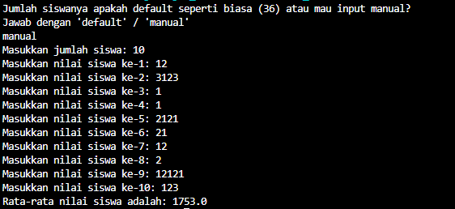
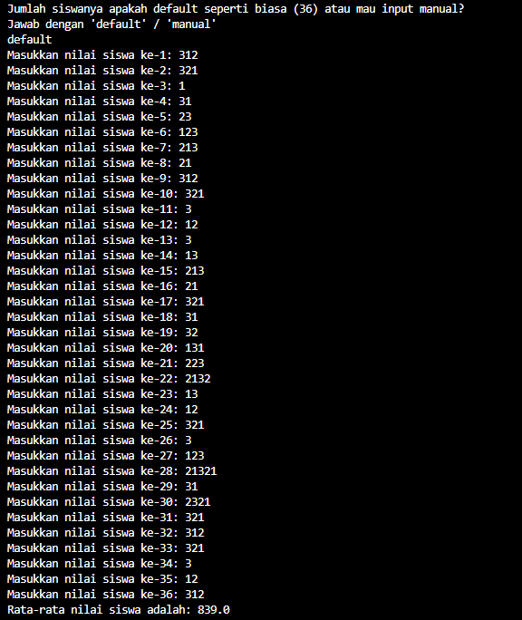

# Soal3SulitNo1
Sebelumnya, kita liat dulu deskripsi soalnya.

Seorang Pendidik akan melakukan rekapitulasi nilai ujian Produktif RPL dari sejumlah siswa. Buatlah sebuah program dalam bahasa Java untuk membantu guru tersebut memasukkan nilai-nilai ujian dan kemudian mencetak nilai rata-rata dari seluruh nilai tersebut. Jumlah siswa dimasukkan dalam bentuk inputan.

So, kesimpulannya si, ini mending pakai array dah. Agar mempermudah hidup.. Inti:
1. Ada untuk input jumlah siswa
2. Ada input memasukkan nilai-nilai ujian (loop)
3. Cetak nilai rata-rata.

This is simple. Just use array for happy living.

This is how i solved it.
1. if (pilihan.equalsIgnoreCase("manual")) {
            System.out.print("Masukkan jumlah siswa: ");
            jumlahSiswa = input.nextInt();
        } else if (pilihan.equalsIgnoreCase("default")) {
            jumlahSiswa = 36;
        } else {
            System.out.println("Something wrong with YOU sir. Goodbye.");
                input.close();
            return;
        }
   i add the default because it is a shortcut. Because the average class has 36 student.
2. double[] nilaiSiswa = new double[jumlahSiswa];
        int totalNilai = 0;
        for (int i = 0; i < jumlahSiswa; i++) {
            System.out.print("Masukkan nilai siswa ke-" + (i + 1) + ": ");
            nilaiSiswa[i] = input.nextDouble();
            totalNilai += nilaiSiswa[i];
        }
3. double rataRata =  totalNilai / jumlahSiswa;
        System.out.printf("Rata-rata nilai siswa adalah: " + rataRata);

Just like that. Solved.

output programs:

   
